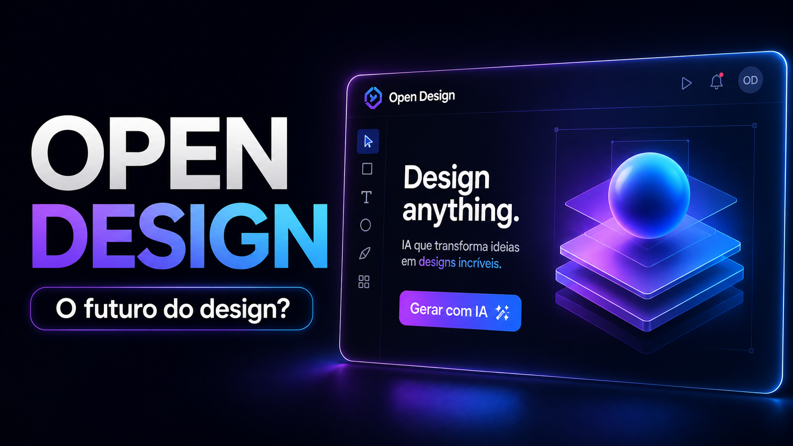

# Open Design

> **A alternativa open-source ao [Claude Design][cd].** Local-first, implantável na web, BYOK em todas as camadas — **11 CLIs de agentes de codificação** detectados automaticamente no seu `PATH` (Claude Code, Codex, Cursor Agent, Gemini CLI, OpenCode, Qwen, GitHub Copilot CLI, Hermes, Kimi, Pi, Kiro) tornam-se o motor de design, conduzidos por **31 Skills componíveis** e **72 Design Systems de qualidade de marca**. Sem CLI? Um proxy BYOK compatível com OpenAI executa o mesmo loop, dispensando o spawn.

<p align="center">
  
</p>

<p align="center">
  <a href="https://github.com/nexu-io/open-design/stargazers"></a>
  <a href="https://github.com/nexu-io/open-design/network/members"></a>
  <a href="https://github.com/nexu-io/open-design/issues"></a>
  <a href="https://github.com/nexu-io/open-design/pulls"></a>
  <a href="https://github.com/nexu-io/open-design/graphs/contributors"></a>
  <a href="https://github.com/nexu-io/open-design/commits/main"></a>
  <a href="https://github.com/nexu-io/open-design/commits/main"></a>
</p>

<p align="center">
  <a href="https://github.com/nexu-io/open-design/releases/latest"></a>
  <a href="LICENSE"></a>
  <a href="#agentes-de-codificacao-suportados"></a>
  <a href="#design-systems"></a>
  <a href="#skills"></a>
  <a href="QUICKSTART.md"></a>
</p>

<p align="center"><a href="README.md">English</a> · <a href="README.de.md">Deutsch</a> · <a href="README.zh-CN.md">简体中文</a> · <a href="README.zh-TW.md">繁體中文</a> · <a href="README.ko.md">한국어</a> · <a href="README.ja-JP.md">日本語</a> · <b>Português (BR)</b></p>

---

## Por que isto existe

O [Claude Design][cd] da Anthropic (lançado em 2026-04-17, Opus 4.7) mostrou o que acontece quando um LLM para de escrever prosa e começa a entregar artefatos de design. Viralizou — e permaneceu de código fechado, pago, apenas na nuvem, preso ao modelo da Anthropic e às skills da Anthropic. Não há checkout, não há self-host, não há deploy na Vercel, não há troca por seu próprio agente.

**Open Design (OD) é a alternativa open-source.** Mesmo loop, mesmo modelo mental artifact-first, nada do lock-in. Não enviamos um agente — os agentes de codificação mais fortes já vivem no seu laptop. Nós os conectamos a um fluxo de design orientado por skills que roda localmente com `pnpm tools-dev`, pode implantar a camada web na Vercel, e permanece BYOK em todas as camadas.

Digite `crie um pitch deck estilo revista para nossa rodada seed`. O formulário de perguntas interativo aparece antes que o modelo improvise um único pixel. O agente escolhe uma de cinco direções visuais curadas. Um plano `TodoWrite` ao vivo é transmitido para a UI. O daemon constrói uma pasta de projeto real em disco com um template seed, biblioteca de layouts e checklist de auto-verificação. O agente os lê — pre-flight aplicado — executa uma crítica de cinco dimensões contra a sua própria saída, e emite um único `<artifact>` que renderiza em um iframe sandboxed segundos depois.

Isso não é "IA tentando desenhar algo". É uma IA que foi treinada, pela stack de prompts, a se comportar como uma designer sênior com um sistema de arquivos funcional, uma biblioteca determinística de paletas e uma cultura de checklist — exatamente o nível que o Claude Design estabeleceu, mas aberto e seu.

OD se apoia em quatro ombros open-source:

- [**`alchaincyf/huashu-design`**](https://github.com/alchaincyf/huashu-design) — a bússola da filosofia de design. Workflow Junior-Designer, o protocolo de 5 passos para ativos de marca, o checklist anti-AI-slop, a auto-crítica de 5 dimensões, e a ideia "5 escolas × 20 filosofias de design" por trás do nosso seletor de direções — tudo destilado em [`apps/web/src/prompts/discovery.ts`](apps/web/src/prompts/discovery.ts).
- [**`op7418/guizang-ppt-skill`**](https://github.com/op7418/guizang-ppt-skill) — o modo deck. Empacotado verbatim em [`skills/guizang-ppt/`](skills/guizang-ppt/) com a LICENSE original preservada; layouts estilo revista, hero WebGL, checklists P0/P1/P2.
- [**`OpenCoworkAI/open-codesign`**](https://github.com/OpenCoworkAI/open-codesign) — a estrela-guia de UX e nosso par mais próximo. A primeira alternativa open-source ao Claude Design. Pegamos emprestado seu loop de streaming-artifact, seu padrão de preview em iframe sandboxed (React 18 + Babel vendorizado), seu painel de agente ao vivo (todos + chamadas de ferramenta + geração interrompível), e sua lista de exportação em cinco formatos (HTML / PDF / PPTX / ZIP / Markdown). Divergimos deliberadamente no formato — eles são um app desktop Electron empacotando [`pi-ai`][piai]; nós somos um web app + daemon local que delega para sua CLI existente.
- [**`multica-ai/multica`**](https://github.com/multica-ai/multica) — a arquitetura daemon-and-runtime. Detecção de agentes via PATH-scan, o daemon local como o único processo privilegiado, a visão de mundo agente-como-companheiro-de-equipe.

## Visão geral

| | O que você ganha |
|---|---|
| **CLIs de agente de codificação (11)** | Claude Code · Codex CLI · Cursor Agent · Gemini CLI · OpenCode · Qwen Code · GitHub Copilot CLI · Hermes (ACP) · Kimi CLI (ACP) · Pi (RPC) · Kiro CLI (ACP) — detectados automaticamente no `PATH`, troque com um clique |
| **Fallback BYOK** | Proxy compatível com OpenAI em `/api/proxy/stream` — cole `baseUrl` + `apiKey` + `model` e qualquer fornecedor (Anthropic-via-OpenAI, DeepSeek, Groq, MiMo, OpenRouter, seu vLLM auto-hospedado, ou qualquer outro provedor compatível com OpenAI) torna-se o motor. IPs internos/SSRF bloqueados na borda do daemon. |
| **Design systems integrados** | **129** — 2 starters escritos à mão + 70 sistemas de produtos (Linear, Stripe, Vercel, Airbnb, Tesla, Notion, Anthropic, Apple, Cursor, Supabase, Figma, Xiaohongshu, …) de [`awesome-design-md`][acd2], mais 57 design skills de [`awesome-design-skills`][ads] adicionadas diretamente em `design-systems/` |
| **Skills integradas** | **31** — 27 no modo `prototype` (web-prototype, saas-landing, dashboard, mobile-app, gamified-app, social-carousel, magazine-poster, dating-web, sprite-animation, motion-frames, critique, tweaks, wireframe-sketch, pm-spec, eng-runbook, finance-report, hr-onboarding, invoice, kanban-board, team-okrs, …) + 4 no modo `deck` (`guizang-ppt` · `simple-deck` · `replit-deck` · `weekly-update`). Agrupadas no seletor por `scenario`: design / marketing / operation / engineering / product / finance / hr / sale / personal. |
| **Direções visuais** | 5 escolas curadas (Editorial Monocle · Modern Minimal · Warm Soft · Tech Utility · Brutalist Experimental) — cada uma traz uma paleta OKLch determinística + font stack ([`apps/web/src/prompts/directions.ts`](apps/web/src/prompts/directions.ts)) |
| **Frames de dispositivo** | iPhone 15 Pro · Pixel · iPad Pro · MacBook · Browser Chrome — pixel-accurate, compartilhados entre skills em [`assets/frames/`](assets/frames/) |
| **Runtime do agente** | O daemon local faz spawn da CLI na pasta do seu projeto — o agente recebe `Read`, `Write`, `Bash`, `WebFetch` reais contra um ambiente real em disco, com fallbacks para `ENAMETOOLONG` no Windows (stdin / arquivo de prompt) em todo adapter |
| **Importações** | Solte um ZIP de exportação do [Claude Design][cd] no diálogo de boas-vindas — `POST /api/import/claude-design` o decompõe em um projeto real para que seu agente continue editando de onde a Anthropic parou |
| **Persistência** | SQLite em `.od/app.sqlite`: projetos · conversas · mensagens · abas · templates salvos. Reabra amanhã, o card de todo e os arquivos abertos estão exatamente onde você deixou. |
| **Lifecycle** | Um único ponto de entrada: `pnpm tools-dev` (start / stop / run / status / logs / inspect / check) — inicializa daemon + web (+ desktop) sob stamps de sidecar tipados |
| **Desktop** | Shell Electron opcional com renderer sandboxed + IPC de sidecar (STATUS / EVAL / SCREENSHOT / CONSOLE / CLICK / SHUTDOWN) — alimenta `tools-dev inspect desktop screenshot` para E2E |
| **Implantável em** | Local (`pnpm tools-dev`) · camada web na Vercel · Electron empacotado (placeholder, em andamento) |
| **Licença** | Apache-2.0 |

[acd2]: https://github.com/VoltAgent/awesome-design-md
[ads]: https://github.com/bergside/awesome-design-skills

## Demo

<table>
<tr>
<td width="50%">
<br/>
<sub><b>Tela de entrada</b> — escolha uma skill, escolha um design system, digite o brief. A mesma superfície para protótipos, decks, apps mobile, dashboards e páginas editoriais.</sub>
</td>
<td width="50%">
<br/>
<sub><b>Formulário de descoberta do turno 1</b> — antes que o modelo escreva um pixel, o OD trava o brief: superfície, audiência, tom, contexto de marca, escala. 30 segundos de radios derrotam 30 minutos de redirecionamentos.</sub>
</td>
</tr>
<tr>
<td width="50%">
<br/>
<sub><b>Seletor de direções</b> — quando o usuário não tem marca, o agente emite um segundo formulário com 5 direções curadas (Monocle / Modern Minimal / Tech Utility / Brutalist / Soft Warm). Um clique no radio → uma paleta + font stack determinísticos, sem freestyle do modelo.</sub>
</td>
<td width="50%">
<br/>
<sub><b>Progresso de todos ao vivo</b> — o plano do agente é transmitido como um card ao vivo. Atualizações de <code>in_progress</code> → <code>completed</code> chegam em tempo real. O usuário pode redirecionar barato, em pleno voo.</sub>
</td>
</tr>
<tr>
<td width="50%">
<br/>
<sub><b>Preview sandboxed</b> — todo <code>&lt;artifact&gt;</code> renderiza em um iframe srcdoc limpo. Editável no local via o workspace de arquivos; baixável como HTML, PDF, ZIP.</sub>
</td>
<td width="50%">
<br/>
<sub><b>Biblioteca de 72 sistemas</b> — todo sistema de produto mostra sua assinatura de 4 cores. Clique para o <code>DESIGN.md</code> completo, grid de swatches e showcase ao vivo.</sub>
</td>
</tr>
<tr>
<td width="50%">
<br/>
<sub><b>Modo deck (guizang-ppt)</b> — o <a href="https://github.com/op7418/guizang-ppt-skill"><code>guizang-ppt-skill</code></a> empacotado entra inalterado. Layouts de revista, fundos hero WebGL, saída HTML em arquivo único, exportação PDF.</sub>
</td>
<td width="50%">
<br/>
<sub><b>Protótipo mobile</b> — chrome do iPhone 15 Pro pixel-accurate (Dynamic Island, SVGs da status bar, indicador de home). Protótipos multi-tela usam os ativos compartilhados de <code>/frames/</code> para que o agente nunca redesenhe um celular.</sub>
</td>
</tr>
</table>

## Skills

**31 skills vêm na caixa.** Cada uma é uma pasta em [`skills/`](skills/) seguindo a convenção [`SKILL.md`][skill] do Claude Code com um frontmatter `od:` estendido que o daemon parseia verbatim — `mode`, `platform`, `scenario`, `preview.type`, `design_system.requires`, `default_for`, `featured`, `fidelity`, `speaker_notes`, `animations`, `example_prompt` ([`apps/daemon/src/skills.ts`](apps/daemon/src/skills.ts)).

Dois **modos** de topo carregam o catálogo: **`prototype`** (27 skills — qualquer coisa que renderize como um artefato de página única, de uma landing de revista a uma tela de celular ou um documento de spec de PM) e **`deck`** (4 skills — apresentações com swipe horizontal e chrome de framework de deck). O campo **`scenario`** é por onde o seletor as agrupa: `design` · `marketing` · `operation` · `engineering` · `product` · `finance` · `hr` · `sale` · `personal`.

### Exemplos do showcase

As skills visualmente mais distintivas que você provavelmente vai rodar primeiro. Cada uma traz um `example.html` real que você pode abrir direto do repo para ver exatamente o que o agente vai produzir — sem auth, sem setup.

<table>
<tr>
<td width="50%" valign="top">
<a href="skills/dating-web/"></a><br/>
<sub><b><a href="skills/dating-web/"><code>dating-web</code></a></b> · <i>prototype</i><br/>Dashboard de namoro / matchmaking — nav lateral à esquerda, ticker bar, KPIs, gráfico de matches mútuos de 30 dias, tipografia editorial.</sub>
</td>
<td width="50%" valign="top">
<a href="skills/digital-eguide/"></a><br/>
<sub><b><a href="skills/digital-eguide/"><code>digital-eguide</code></a></b> · <i>template</i><br/>E-guia digital de duas spreads — capa (título, autor, prévia do TOC) + spread de aula com pull-quote e lista de passos. Tom criador / lifestyle.</sub>
</td>
</tr>
<tr>
<td width="50%" valign="top">
<a href="skills/email-marketing/"></a><br/>
<sub><b><a href="skills/email-marketing/"><code>email-marketing</code></a></b> · <i>prototype</i><br/>E-mail HTML de lançamento de produto da marca — masthead, imagem hero, lockup do título, CTA, grid de specs. Coluna única centralizada, com fallback de tabela seguro.</sub>
</td>
<td width="50%" valign="top">
<a href="skills/gamified-app/"></a><br/>
<sub><b><a href="skills/gamified-app/"><code>gamified-app</code></a></b> · <i>prototype</i><br/>Protótipo de mobile-app gamificado em três frames sobre um stage escuro de showcase — capa, missões do dia com fitas de XP + barra de nível, detalhe da missão.</sub>
</td>
</tr>
<tr>
<td width="50%" valign="top">
<a href="skills/mobile-onboarding/"></a><br/>
<sub><b><a href="skills/mobile-onboarding/"><code>mobile-onboarding</code></a></b> · <i>prototype</i><br/>Fluxo de onboarding mobile em três frames — splash, value-prop, sign-in. Status bar, dots de swipe, CTA primário.</sub>
</td>
<td width="50%" valign="top">
<a href="skills/motion-frames/"></a><br/>
<sub><b><a href="skills/motion-frames/"><code>motion-frames</code></a></b> · <i>prototype</i><br/>Hero de motion design em frame único com animações CSS em loop — anel de tipo rotacionando, globo animado, timer pulsando. Pronto para hand-off para HyperFrames.</sub>
</td>
</tr>
<tr>
<td width="50%" valign="top">
<a href="skills/social-carousel/"></a><br/>
<sub><b><a href="skills/social-carousel/"><code>social-carousel</code></a></b> · <i>prototype</i><br/>Carrossel de social media 1080×1080 em três cards — painéis cinematográficos com títulos display que se conectam ao longo da série, logo da marca, indicação de loop.</sub>
</td>
<td width="50%" valign="top">
<a href="skills/sprite-animation/"></a><br/>
<sub><b><a href="skills/sprite-animation/"><code>sprite-animation</code></a></b> · <i>prototype</i><br/>Slide explicador animado pixel / 8-bit — stage cream full-bleed, mascote pixel animado, tipo display kinético japonês, keyframes CSS em loop.</sub>
</td>
</tr>
</table>

### Superfícies de design & marketing (modo prototype)

| Skill | Plataforma | Cenário | O que produz |
|---|---|---|---|
| [`web-prototype`](skills/web-prototype/) | desktop | design | HTML de página única — landings, marketing, hero pages (default para prototype) |
| [`saas-landing`](skills/saas-landing/) | desktop | marketing | Layout de marketing com hero / features / pricing / CTA |
| [`dashboard`](skills/dashboard/) | desktop | operation | Admin / analytics com sidebar + layout de dados denso |
| [`pricing-page`](skills/pricing-page/) | desktop | sale | Tabelas de pricing + comparação standalone |
| [`docs-page`](skills/docs-page/) | desktop | engineering | Layout de documentação em 3 colunas |
| [`blog-post`](skills/blog-post/) | desktop | marketing | Long-form editorial |
| [`mobile-app`](skills/mobile-app/) | mobile | design | Tela(s) de app emolduradas em iPhone 15 Pro / Pixel |
| [`mobile-onboarding`](skills/mobile-onboarding/) | mobile | design | Fluxo de onboarding mobile multi-tela (splash · value-prop · sign-in) |
| [`gamified-app`](skills/gamified-app/) | mobile | personal | Protótipo de mobile-app gamificado em três frames |
| [`email-marketing`](skills/email-marketing/) | desktop | marketing | E-mail HTML de lançamento de produto (com fallback de tabela seguro) |
| [`social-carousel`](skills/social-carousel/) | desktop | marketing | Carrossel social de 3 cards 1080×1080 |
| [`magazine-poster`](skills/magazine-poster/) | desktop | marketing | Poster de página única estilo revista |
| [`motion-frames`](skills/motion-frames/) | desktop | marketing | Hero de motion design com animações CSS em loop |
| [`sprite-animation`](skills/sprite-animation/) | desktop | marketing | Slide explicador animado pixel / 8-bit |
| [`dating-web`](skills/dating-web/) | desktop | personal | Mockup de dashboard de namoro |
| [`digital-eguide`](skills/digital-eguide/) | desktop | marketing | E-guia digital em duas spreads (capa + aula) |
| [`wireframe-sketch`](skills/wireframe-sketch/) | desktop | design | Sketch de ideação desenhado à mão — para o passo "mostre algo visível cedo" |
| [`critique`](skills/critique/) | desktop | design | Folha de auto-crítica de cinco dimensões (Filosofia · Hierarquia · Detalhe · Função · Inovação) |
| [`tweaks`](skills/tweaks/) | desktop | design | Painel de tweaks emitidos pela IA — o modelo levanta os parâmetros que valem a pena ajustar |

### Superfícies de deck (modo deck)

| Skill | Default para | O que produz |
|---|---|---|
| [`guizang-ppt`](skills/guizang-ppt/) | **default** para deck | Web PPT estilo revista — empacotado verbatim de [op7418/guizang-ppt-skill][guizang], LICENSE original preservada |
| [`simple-deck`](skills/simple-deck/) | — | Deck minimalista de swipe horizontal |
| [`replit-deck`](skills/replit-deck/) | — | Deck de walkthrough de produto (estilo Replit) |
| [`weekly-update`](skills/weekly-update/) | — | Cadência semanal de equipe como deck de swipe (progresso · blockers · próximos) |

### Superfícies de office & operações (modo prototype, cenários flavor de documento)

| Skill | Cenário | O que produz |
|---|---|---|
| [`pm-spec`](skills/pm-spec/) | product | Doc de especificação de PM com TOC + log de decisões |
| [`team-okrs`](skills/team-okrs/) | product | Folha de pontuação de OKRs |
| [`meeting-notes`](skills/meeting-notes/) | operation | Log de decisões de reunião |
| [`kanban-board`](skills/kanban-board/) | operation | Snapshot de board |
| [`eng-runbook`](skills/eng-runbook/) | engineering | Runbook de incidentes |
| [`finance-report`](skills/finance-report/) | finance | Sumário executivo financeiro |
| [`invoice`](skills/invoice/) | finance | Fatura de página única |
| [`hr-onboarding`](skills/hr-onboarding/) | hr | Plano de onboarding de cargo |

Adicionar uma skill exige uma pasta. Leia [`docs/skills-protocol.md`](docs/skills-protocol.md) para o frontmatter estendido, faça fork de uma skill existente, reinicie o daemon, ela aparece no seletor. O endpoint do catálogo é `GET /api/skills`; a montagem de seed por skill (template + referências de side-files) vive em `GET /api/skills/:id/example`.

## Seis ideias estruturais

### 1 · Não enviamos um agente. O seu já basta.

O daemon escaneia seu `PATH` em busca de [`claude`](https://docs.anthropic.com/en/docs/claude-code), [`codex`](https://github.com/openai/codex), [`cursor-agent`](https://www.cursor.com/cli), [`gemini`](https://github.com/google-gemini/gemini-cli), [`opencode`](https://opencode.ai/), [`qwen`](https://github.com/QwenLM/qwen-code), [`copilot`](https://github.com/features/copilot/cli), `hermes`, `kimi`, [`pi`](https://github.com/mariozechner/pi-ai), e [`kiro-cli`](https://kiro.dev) na inicialização. Aqueles que ele encontra tornam-se motores de design candidatos — conduzidos por stdio com um adapter por CLI, intercambiáveis a partir do seletor de modelo. Inspirado por [`multica`](https://github.com/multica-ai/multica) e [`cc-switch`](https://github.com/farion1231/cc-switch). Sem CLI instalada? `POST /api/proxy/stream` é o mesmo pipeline sem o spawn — cole qualquer `baseUrl` + `apiKey` compatível com OpenAI e o daemon encaminha os chunks SSE de volta, com destinos loopback / link-local / RFC1918 rejeitados na borda.

### 2 · Skills são arquivos, não plugins.

Seguindo a [convenção `SKILL.md`](https://docs.anthropic.com/en/docs/claude-code/skills) do Claude Code, cada skill é `SKILL.md` + `assets/` + `references/`. Solte uma pasta em [`skills/`](skills/), reinicie o daemon, ela aparece no seletor. O `magazine-web-ppt` empacotado é o [`op7418/guizang-ppt-skill`](https://github.com/op7418/guizang-ppt-skill) commitado verbatim — licença original preservada, atribuição preservada.

### 3 · Design Systems são Markdown portátil, não JSON de tema.

O schema de 9 seções `DESIGN.md` de [`VoltAgent/awesome-design-md`][acd2] — cor, tipografia, espaçamento, layout, componentes, motion, voz, marca, anti-padrões. Todo artefato lê do sistema ativo. Troque o sistema → o próximo render usa os novos tokens. O dropdown vem com **Linear, Stripe, Vercel, Airbnb, Tesla, Notion, Apple, Anthropic, Cursor, Supabase, Figma, Resend, Raycast, Lovable, Cohere, Mistral, ElevenLabs, X.AI, Spotify, Webflow, Sanity, PostHog, Sentry, MongoDB, ClickHouse, Cal, Replicate, Clay, Composio, Xiaohongshu…** — mais 57 design skills vindas de [`awesome-design-skills`][ads].

### 4 · O formulário de perguntas interativo previne 80% dos redirecionamentos.

A stack de prompts do OD codifica uma `RULE 1`: todo brief de design fresco começa com um `<question-form id="discovery">` em vez de código. Superfície · audiência · tom · contexto de marca · escala · restrições. Um brief longo ainda deixa decisões de design em aberto — tom visual, postura de cor, escala — exatamente as coisas que o formulário trava em 30 segundos. O custo de uma direção errada é uma rodada de chat, não um deck terminado.

Este é o **modo Junior-Designer** destilado de [`huashu-design`](https://github.com/alchaincyf/huashu-design): faça as perguntas em batch upfront, mostre algo visível cedo (mesmo um wireframe com blocos cinzas), permita que o usuário redirecione barato. Combinado com o protocolo de ativos de marca (localizar · baixar · `grep` hex · escrever `brand-spec.md` · vocalizar), é a maior razão única pela qual a saída deixa de parecer freestyle de IA e passa a parecer uma designer que prestou atenção antes de pintar.

### 5 · O daemon faz o agente parecer estar no seu laptop, porque está.

O daemon faz spawn da CLI com `cwd` definido para a pasta de artefatos do projeto sob `.od/projects/<id>/`. O agente recebe `Read`, `Write`, `Bash`, `WebFetch` — ferramentas reais contra um sistema de arquivos real. Ele pode `Read` no `assets/template.html` da skill, `grep` no seu CSS por valores hex, escrever um `brand-spec.md`, soltar imagens geradas, e produzir arquivos `.pptx` / `.zip` / `.pdf` que aparecem no workspace de arquivos como chips de download quando a turn termina. Sessões, conversas, mensagens, abas persistem em um DB SQLite local — abra o projeto amanhã e o card de todo do agente está exatamente onde você deixou.

### 6 · A stack de prompts é o produto.

O que você compõe na hora do envio não é "system + user". É:

```
DISCOVERY directives  (formulário do turn-1, branch de marca do turn-2, TodoWrite, crítica de 5 dimensões)
  + identity charter   (OFFICIAL_DESIGNER_PROMPT, anti-AI-slop, junior-pass)
  + DESIGN.md ativo    (72 sistemas disponíveis)
  + SKILL.md ativo     (31 skills disponíveis)
  + metadata do projeto (kind, fidelity, speakerNotes, animations, ids de inspiração)
  + side files da skill (auto-injetados em pre-flight: ler assets/template.html + references/*.md)
  + (deck kind, sem seed de skill) DECK_FRAMEWORK_DIRECTIVE   (nav / counter / scroll / print)
```

Cada camada é componível. Cada camada é um arquivo que você pode editar. Leia [`apps/web/src/prompts/system.ts`](apps/web/src/prompts/system.ts) e [`apps/web/src/prompts/discovery.ts`](apps/web/src/prompts/discovery.ts) para ver o contrato real.

## Arquitetura

```
┌────────────────────── browser (Next.js 16) ──────────────────────┐
│  chat · workspace de arquivos · preview iframe · settings · imports │
└──────────────┬───────────────────────────────────┬───────────────┘
               │ /api/* (reescrito em dev)          │
               ▼                                    ▼
   ┌──────────────────────────────────┐   /api/proxy/stream (SSE)
   │  Daemon local (Express + SQLite) │   ─→ qualquer endpoint
   │                                  │       compatível com OpenAI (BYOK)
   │  /api/agents          /api/skills│       com bloqueio SSRF
   │  /api/design-systems  /api/projects/…
   │  /api/chat (SSE)      /api/proxy/stream (SSE)
   │  /api/templates       /api/import/claude-design
   │  /api/artifacts/save  /api/artifacts/lint
   │  /api/upload          /api/projects/:id/files…
   │  /artifacts (static)  /frames (static)
   │
   │  opcional: IPC de sidecar em /tmp/open-design/ipc/<ns>/<app>.sock
   │  (STATUS · EVAL · SCREENSHOT · CONSOLE · CLICK · SHUTDOWN)
   └─────────┬────────────────────────┘
             │ spawn(cli, [...], { cwd: .od/projects/<id> })
             ▼
   ┌──────────────────────────────────────────────────────────────────┐
   │  claude · codex · gemini · opencode · cursor-agent · qwen        │
   │  copilot · hermes (ACP) · kimi (ACP) · pi (RPC) · kiro (ACP)      │
   │  lê SKILL.md + DESIGN.md, escreve artefatos no disco             │
   └──────────────────────────────────────────────────────────────────┘
```

| Camada | Stack |
|---|---|
| Frontend | Next.js 16 App Router + React 18 + TypeScript, deployable na Vercel |
| Daemon | Node 24 · Express · streaming SSE · `better-sqlite3`; tabelas: `projects` · `conversations` · `messages` · `tabs` · `templates` |
| Transporte do agente | `child_process.spawn`; parsers de eventos tipados para `claude-stream-json` (Claude Code), `copilot-stream-json` (Copilot), parsers `json-event-stream` por CLI (Codex / Gemini / OpenCode / Cursor Agent), `acp-json-rpc` (Hermes / Kimi / Kiro via Agent Client Protocol), `pi-rpc` (Pi via JSON-RPC stdio), `plain` (Qwen Code) |
| Proxy BYOK | `POST /api/proxy/stream` → `/v1/chat/completions` compatível com OpenAI, pass-through SSE; rejeita hosts loopback / link-local / RFC1918 na borda do daemon |
| Storage | Arquivos planos em `.od/projects/<id>/` + SQLite em `.od/app.sqlite` (gitignored, auto-criado). Sobreponha a raiz com `OD_DATA_DIR` para isolamento de testes |
| Preview | Iframe sandboxed via `srcdoc` + parser `<artifact>` por skill ([`apps/web/src/artifacts/parser.ts`](apps/web/src/artifacts/parser.ts)) |
| Export | HTML (assets inline) · PDF (impressão do browser, deck-aware) · PPTX (orientado pelo agente via skill) · ZIP (archiver) · Markdown |
| Lifecycle | `pnpm tools-dev start \| stop \| run \| status \| logs \| inspect \| check`; portas via `--daemon-port` / `--web-port`, namespaces via `--namespace` |
| Desktop (opcional) | Shell Electron — descobre a URL web via IPC de sidecar, sem adivinhar portas; o mesmo canal `STATUS`/`EVAL`/`SCREENSHOT`/`CONSOLE`/`CLICK`/`SHUTDOWN` alimenta `tools-dev inspect desktop …` para E2E |

## Quickstart

```bash
git clone https://github.com/nexu-io/open-design.git
cd open-design
corepack enable
corepack pnpm --version   # deve imprimir 10.33.2
pnpm install
pnpm tools-dev run web
# abra a URL web impressa pelo tools-dev
```

Requisitos de ambiente: Node `~24` e pnpm `10.33.x`. `nvm`/`fnm` são ajudantes opcionais; se você usar um, rode `nvm install 24 && nvm use 24` ou `fnm install 24 && fnm use 24` antes de `pnpm install`.

Para inicialização desktop/background, restarts em portas fixas e checagens do dispatcher de geração de mídia (`OD_BIN`, `OD_DAEMON_URL`, `apps/daemon/dist/cli.js`), veja [`QUICKSTART.md`](QUICKSTART.md).

A primeira carga:

1. Detecta quais CLIs de agente você tem no `PATH` e escolhe uma automaticamente.
2. Carrega 31 skills + 72 design systems.
3. Abre o diálogo de boas-vindas para você colar uma chave Anthropic (necessária apenas para o caminho de fallback BYOK).
4. **Auto-cria `./.od/`** — a pasta de runtime local para o DB SQLite de projetos, artefatos por projeto e renders salvos. Não há passo `od init`; o daemon faz `mkdir` em tudo que precisa no boot.

Digite um prompt, aperte **Send**, observe o formulário de perguntas chegar, preencha-o, observe o card de todo fluir, observe o artefato renderizar. Clique em **Save to disk** ou baixe como um ZIP do projeto.

### Estado de primeira execução (`./.od/`)

O daemon possui uma pasta oculta na raiz do repo. Tudo nela é gitignored e local da máquina — nunca faça commit.

```
.od/
├── app.sqlite                 ← projetos · conversas · mensagens · abas abertas
├── artifacts/                 ← renders pontuais "Save to disk" (com timestamp)
└── projects/<id>/             ← diretório de trabalho por projeto, também o cwd do agente
```

| Quer… | Faça isso |
|---|---|
| Inspecionar o que está lá | `ls -la .od && sqlite3 .od/app.sqlite '.tables'` |
| Resetar para um estado limpo | `pnpm tools-dev stop`, `rm -rf .od`, rode `pnpm tools-dev run web` novamente |
| Movê-lo para outro lugar | ainda não suportado — o caminho é hard-coded relativo ao repo |

Mapa completo de arquivos, scripts e troubleshooting → [`QUICKSTART.md`](QUICKSTART.md).

## Estrutura do repositório

```
open-design/
├── README.md                      ← este arquivo (em inglês)
├── README.de.md                   ← Deutsch
├── README.zh-CN.md                ← 简体中文
├── README.pt-BR.md                ← Português (Brasil)
├── QUICKSTART.md                  ← guia de run / build / deploy
├── package.json                   ← workspace pnpm, único bin: od
│
├── apps/
│   ├── daemon/                    ← Node + Express, o único servidor
│   │   ├── src/                   ← fonte TypeScript do daemon
│   │   │   ├── cli.ts             ← fonte do bin `od`, compilado para dist/cli.js
│   │   │   ├── server.ts          ← rotas /api/* (projetos, chat, arquivos, exports)
│   │   │   ├── agents.ts          ← scanner de PATH + builders de argv por CLI
│   │   │   ├── claude-stream.ts   ← parser de JSON em streaming para stdout do Claude Code
│   │   │   ├── skills.ts          ← loader do frontmatter SKILL.md
│   │   │   └── db.ts              ← schema SQLite (projects/messages/templates/tabs)
│   │   ├── sidecar/               ← wrapper de sidecar do daemon para tools-dev
│   │   └── tests/                 ← testes do pacote daemon
│   │
│   └── web/                       ← cliente Next.js 16 App Router + React
│       ├── app/                   ← entrypoints do App Router
│       ├── next.config.ts         ← rewrites de dev + export estático prod para out/
│       └── src/                   ← módulos cliente React + TypeScript
│           ├── App.tsx            ← roteamento, bootstrap, settings
│           ├── components/        ← chat, composer, picker, preview, sketch, …
│           ├── prompts/
│           │   ├── system.ts      ← composeSystemPrompt(base, skill, DS, metadata)
│           │   ├── discovery.ts   ← formulário do turn-1 + branch do turn-2 + crítica 5-dim
│           │   └── directions.ts  ← 5 direções visuais × paleta OKLch + font stack
│           ├── artifacts/         ← parser de <artifact> em streaming + manifests
│           ├── runtime/           ← srcdoc do iframe, markdown, helpers de export
│           ├── providers/         ← transports de SSE do daemon + API BYOK
│           └── state/             ← config + projetos (localStorage + daemon-backed)
│
├── e2e/                           ← Playwright UI + harness de integração externa/Vitest
│
├── packages/
│   ├── contracts/                 ← contratos compartilhados de app web/daemon
│   ├── sidecar-proto/             ← contrato de protocolo de sidecar do Open Design
│   ├── sidecar/                   ← primitivos genéricos de runtime de sidecar
│   └── platform/                  ← primitivos genéricos de processo/plataforma
│
├── skills/                        ← 31 bundles de skill SKILL.md (27 prototype + 4 deck)
│   ├── web-prototype/             ← default para modo prototype
│   ├── saas-landing/  dashboard/  pricing-page/  docs-page/  blog-post/
│   ├── mobile-app/  mobile-onboarding/  gamified-app/
│   ├── email-marketing/  social-carousel/  magazine-poster/
│   ├── motion-frames/  sprite-animation/  digital-eguide/  dating-web/
│   ├── critique/  tweaks/  wireframe-sketch/
│   ├── pm-spec/  team-okrs/  meeting-notes/  kanban-board/
│   ├── eng-runbook/  finance-report/  invoice/  hr-onboarding/
│   ├── simple-deck/  replit-deck/  weekly-update/   ← modo deck
│   └── guizang-ppt/               ← magazine-web-ppt empacotado (default para deck)
│       ├── SKILL.md
│       ├── assets/template.html   ← seed
│       └── references/{themes,layouts,components,checklist}.md
│
├── design-systems/                ← 72 sistemas DESIGN.md
│   ├── default/                   ← Neutral Modern (starter)
│   ├── warm-editorial/            ← Warm Editorial (starter)
│   ├── linear-app/  vercel/  stripe/  airbnb/  notion/  cursor/  apple/  …
│   └── README.md                  ← visão geral do catálogo
│
├── assets/
│   └── frames/                    ← frames de dispositivo compartilhados (uso cross-skill)
│       ├── iphone-15-pro.html
│       ├── android-pixel.html
│       ├── ipad-pro.html
│       ├── macbook.html
│       └── browser-chrome.html
│
├── templates/
│   └── deck-framework.html        ← baseline de deck (nav / counter / print)
│
├── scripts/
│   └── sync-design-systems.ts     ← reimporta o tarball upstream awesome-design-md
│
├── docs/
│   ├── spec.md                    ← spec do produto, cenários, diferenciação
│   ├── architecture.md            ← topologias, fluxo de dados, componentes
│   ├── skills-protocol.md         ← frontmatter od: estendido do SKILL.md
│   ├── agent-adapters.md          ← detecção + dispatch por CLI
│   ├── modes.md                   ← prototype / deck / template / design-system
│   ├── references.md              ← procedência long-form
│   ├── roadmap.md                 ← entrega em fases
│   ├── schemas/                   ← schemas JSON
│   └── examples/                  ← exemplos canônicos de artefatos
│
└── .od/                           ← dados de runtime, gitignored, auto-criado
    ├── app.sqlite                 ← projetos / conversas / mensagens / abas
    ├── projects/<id>/             ← pasta de trabalho por projeto (cwd do agente)
    └── artifacts/                 ← renders pontuais salvos
```

## Design Systems

<p align="center">
  
</p>

72 sistemas na caixa, cada um como um único [`DESIGN.md`](design-systems/README.md):

<details>
<summary><b>Catálogo completo</b> (clique para expandir)</summary>

**AI & LLM** — `claude` · `cohere` · `mistral-ai` · `minimax` · `together-ai` · `replicate` · `runwayml` · `elevenlabs` · `ollama` · `x-ai`

**Developer Tools** — `cursor` · `vercel` · `linear-app` · `framer` · `expo` · `clickhouse` · `mongodb` · `supabase` · `hashicorp` · `posthog` · `sentry` · `warp` · `webflow` · `sanity` · `mintlify` · `lovable` · `composio` · `opencode-ai` · `voltagent`

**Productivity** — `notion` · `figma` · `miro` · `airtable` · `superhuman` · `intercom` · `zapier` · `cal` · `clay` · `raycast`

**Fintech** — `stripe` · `coinbase` · `binance` · `kraken` · `mastercard` · `revolut` · `wise`

**E-Commerce** — `shopify` · `airbnb` · `uber` · `nike` · `starbucks` · `pinterest`

**Media** — `spotify` · `playstation` · `wired` · `theverge` · `meta`

**Automotive** — `tesla` · `bmw` · `ferrari` · `lamborghini` · `bugatti` · `renault`

**Other** — `apple` · `ibm` · `nvidia` · `vodafone` · `sentry` · `resend` · `spacex`

**Starters** — `default` (Neutral Modern) · `warm-editorial`

</details>

A biblioteca de sistemas de produto é importada via [`scripts/sync-design-systems.ts`](scripts/sync-design-systems.ts) de [`VoltAgent/awesome-design-md`][acd2]. Rode novamente para atualizar. As 57 design skills vêm de [`bergside/awesome-design-skills`][ads] e são adicionadas diretamente em `design-systems/`.

## Direções visuais

Quando o usuário não tem brand spec, o agente emite um segundo formulário com cinco direções curadas — a adaptação OD do [fallback "5 escolas × 20 filosofias de design" de `huashu-design`](https://github.com/alchaincyf/huashu-design#%E8%AE%BE%E8%AE%A1%E6%96%B9%E5%90%91%E9%A1%BE%E9%97%AE-fallback). Cada direção é uma spec determinística — paleta em OKLch, font stack, sinais de postura de layout, referências — que o agente vincula verbatim no `:root` do template seed. Um clique no radio → um sistema visual completamente especificado. Sem improvisação, sem AI-slop.

| Direção | Mood | Refs |
|---|---|---|
| Editorial — Monocle / FT | Revista impressa, tinta + cream + ferrugem quente | Monocle · FT Weekend · NYT Magazine |
| Modern minimal — Linear / Vercel | Frio, estruturado, accent mínimo | Linear · Vercel · Stripe |
| Tech utility | Densidade de informação, monospace, terminal | Bloomberg · ferramentas Bauhaus |
| Brutalist | Cru, tipo oversized, sem sombras, accents ásperos | Bloomberg Businessweek · Achtung |
| Soft warm | Generoso, baixo contraste, neutros pêssego | Notion marketing · Apple Health |

Spec completa → [`apps/web/src/prompts/directions.ts`](apps/web/src/prompts/directions.ts).

## Além do chat — o que mais vem incluído

O loop de chat / artefato pega o destaque, mas várias capacidades menos visíveis já estão conectadas e valem ser conhecidas antes de comparar OD com qualquer outra coisa:

- **Importação de ZIP do Claude Design.** Solte uma exportação de claude.ai no diálogo de boas-vindas. `POST /api/import/claude-design` extrai em um real `.od/projects/<id>/`, abre o arquivo de entrada como aba, e prepara um prompt continue-de-onde-a-Anthropic-parou para seu agente local. Sem re-prompting, sem "peça ao modelo para recriar o que acabamos de ter". ([`apps/daemon/src/server.ts`](apps/daemon/src/server.ts) — `/api/import/claude-design`)
- **Proxy BYOK compatível com OpenAI.** `POST /api/proxy/stream` aceita `{ baseUrl, apiKey, model, messages }`, normaliza o caminho (`…/v1/chat/completions`), encaminha chunks SSE de volta ao browser, e rejeita destinos loopback / link-local / RFC1918 para evitar SSRF. Qualquer coisa que fale o schema chat OpenAI funciona — shim Anthropic-via-OpenAI, DeepSeek, Groq, MiMo, OpenRouter, seu vLLM auto-hospedado. MiMo recebe `tool_choice: 'none'` automaticamente porque seu schema de tools se comporta mal em geração free-form.
- **Templates salvos pelo usuário.** Uma vez que você gosta de um render, `POST /api/templates` faz snapshot do HTML + metadata na tabela `templates` do SQLite. O próximo projeto o escolhe a partir de uma linha "your templates" no seletor — mesma superfície que as 31 enviadas, mas suas.
- **Persistência de abas.** Todo projeto lembra seus arquivos abertos e a aba ativa na tabela `tabs`. Reabra o projeto amanhã e o workspace fica exatamente do jeito que você deixou.
- **API de lint de artefatos.** `POST /api/artifacts/lint` roda checagens estruturais em um artefato gerado (framing `<artifact>` quebrado, side files obrigatórios faltando, tokens de paleta velhos) e retorna findings que o agente pode ler de volta no próximo turn. A auto-crítica de cinco dimensões usa isso para fundamentar sua pontuação em evidência real, não vibes.
- **Protocolo de sidecar + automação desktop.** Processos daemon, web e desktop carregam stamps tipados de cinco campos (`app · mode · namespace · ipc · source`) e expõem um canal IPC JSON-RPC em `/tmp/open-design/ipc/<namespace>/<app>.sock`. `tools-dev inspect desktop status \| eval \| screenshot` dirige esse canal, então E2E headless funciona contra um shell Electron real sem harnesses sob medida ([`packages/sidecar-proto/`](packages/sidecar-proto/), [`apps/desktop/src/main/`](apps/desktop/src/main/)).
- **Spawning Windows-friendly.** Todo adapter que de outra forma estouraria o limite ~32 KB de argv de `CreateProcess` em prompts compostos longos (Codex, Gemini, OpenCode, Cursor Agent, Qwen, Pi) alimenta o prompt via stdin. Claude Code e Copilot mantêm `-p`; o daemon faz fallback para um arquivo de prompt temporário quando até isso transborda.
- **Dados de runtime por namespace.** `OD_DATA_DIR` e `--namespace` te dão árvores `.od/` totalmente isoladas, então Playwright, canais beta e seus projetos reais nunca compartilham um arquivo SQLite.

## Maquinário anti-AI-slop

Todo o maquinário abaixo é o playbook de [`huashu-design`](https://github.com/alchaincyf/huashu-design), portado para a stack de prompts do OD e tornado aplicável por skill via o pre-flight de side files. Leia [`apps/web/src/prompts/discovery.ts`](apps/web/src/prompts/discovery.ts) para o fraseado vivo:

- **Formulário de perguntas primeiro.** O turn 1 é apenas `<question-form>` — sem thinking, sem ferramentas, sem narração. O usuário escolhe defaults na velocidade do radio.
- **Extração de brand-spec.** Quando o usuário anexa um screenshot ou URL, o agente roda um protocolo de cinco passos (localizar · baixar · grep hex · codificar `brand-spec.md` · vocalizar) antes de escrever CSS. **Nunca adivinha cores de marca da memória.**
- **Crítica 5-dim.** Antes de emitir `<artifact>`, o agente pontua silenciosamente sua saída de 1–5 em filosofia / hierarquia / execução / especificidade / contenção. Qualquer coisa abaixo de 3/5 é uma regressão — corrige e re-pontua. Dois passes é normal.
- **Checklist P0/P1/P2.** Toda skill envia um `references/checklist.md` com gates P0 rígidos. O agente deve passar P0 antes de emitir.
- **Blacklist de slop.** Gradientes roxos agressivos, ícones emoji genéricos, card arredondado com accent de borda esquerda, humanos SVG desenhados à mão, Inter como face *display*, métricas inventadas — explicitamente proibidos no prompt.
- **Placeholders honestos > stats falsos.** Quando o agente não tem um número real, ele escreve `—` ou um bloco cinza rotulado, não "10× mais rápido".

## Comparação

| Eixo | [Claude Design][cd] (Anthropic) | [Open CoDesign][ocod] | **Open Design** |
|---|---|---|---|
| Licença | Fechada | MIT | **Apache-2.0** |
| Form factor | Web (claude.ai) | Desktop (Electron) | **App web + daemon local** |
| Implantável na Vercel | ❌ | ❌ | **✅** |
| Runtime do agente | Empacotado (Opus 4.7) | Empacotado ([`pi-ai`][piai]) | **Delegado para a CLI existente do usuário** |
| Skills | Proprietárias | 12 módulos TS customizados + `SKILL.md` | **31 bundles [`SKILL.md`][skill] baseados em arquivo, soltáveis** |
| Design system | Proprietário | `DESIGN.md` (roadmap v0.2) | **`DESIGN.md` × 129 sistemas enviados** |
| Flexibilidade de provider | Apenas Anthropic | 7+ via [`pi-ai`][piai] | **10 adapters de CLI + proxy BYOK compatível com OpenAI** |
| Formulário de perguntas inicial | ❌ | ❌ | **✅ Regra rígida, turn 1** |
| Seletor de direções | ❌ | ❌ | **✅ 5 direções determinísticas** |
| Progresso de todos ao vivo + stream de tools | ❌ | ✅ | **✅** (padrão UX de open-codesign) |
| Preview iframe sandboxed | ❌ | ✅ | **✅** (padrão de open-codesign) |
| Importação de ZIP do Claude Design | n/a | ❌ | **✅ `POST /api/import/claude-design` — continue editando de onde a Anthropic parou** |
| Edições cirúrgicas em modo comentário | ❌ | ✅ | 🚧 roadmap (lift de open-codesign) |
| Painel de tweaks emitidos pela IA | ❌ | ✅ | 🟡 parcial — a [skill `tweaks`](skills/tweaks/) é enviada, UX de painel dedicado lateral ao chat ainda no roadmap |
| Workspace nível-filesystem | ❌ | parcial (sandbox Electron) | **✅ cwd real, ferramentas reais, SQLite persistido (projects · conversations · messages · tabs · templates)** |
| Auto-crítica 5-dim | ❌ | ❌ | **✅ Gate pre-emit** |
| Lint de artefatos | ❌ | ❌ | **✅ `POST /api/artifacts/lint` — findings retornados ao agente** |
| IPC de sidecar + desktop headless | ❌ | ❌ | **✅ Processos com stamp + `tools-dev inspect desktop status \| eval \| screenshot`** |
| Formatos de export | Limitado | HTML / PDF / PPTX / ZIP / Markdown | **HTML / PDF / PPTX (orientado pelo agente) / ZIP / Markdown** |
| Reuso de skill PPT | N/A | Built-in | **[`guizang-ppt-skill`][guizang] entra (default para modo deck)** |
| Cobrança mínima | Pro / Max / Team | BYOK | **BYOK — cole qualquer `baseUrl` compatível com OpenAI** |

[cd]: https://x.com/claudeai/status/2045156267690213649
[ocod]: https://github.com/OpenCoworkAI/open-codesign
[piai]: https://github.com/mariozechner/pi-ai
[acd]: https://github.com/VoltAgent/awesome-claude-design
[guizang]: https://github.com/op7418/guizang-ppt-skill
[skill]: https://docs.anthropic.com/en/docs/claude-code/skills

## Agentes de codificação suportados

Detectados automaticamente do `PATH` no boot do daemon. Sem config necessária. O dispatch de streaming vive em [`apps/daemon/src/agents.ts`](apps/daemon/src/agents.ts) (`AGENT_DEFS`); parsers por CLI vivem ao lado dele. Modelos são populados ou por probing `<bin> --list-models` / `<bin> models` / handshake ACP, ou de uma lista de fallback curada quando a CLI não expõe uma lista.

| Agente | Bin | Formato de stream | Forma do argv (caminho de prompt composto) |
|---|---|---|---|
| [Claude Code](https://docs.anthropic.com/en/docs/claude-code) | `claude` | `claude-stream-json` (eventos tipados) | `claude -p <prompt> --output-format stream-json --verbose [--include-partial-messages] [--add-dir …] --permission-mode bypassPermissions` |
| [Codex CLI](https://github.com/openai/codex) | `codex` | `json-event-stream` + parser `codex` | `codex exec --json --skip-git-repo-check --full-auto [-C cwd] [--model …] [-c model_reasoning_effort=…] -` (prompt no stdin) |
| [Gemini CLI](https://github.com/google-gemini/gemini-cli) | `gemini` | `json-event-stream` + parser `gemini` | `gemini --output-format stream-json --skip-trust --yolo [--model …] -` (prompt no stdin) |
| [OpenCode](https://opencode.ai/) | `opencode` | `json-event-stream` + parser `opencode` | `opencode run --format json --dangerously-skip-permissions [--model …] -` (prompt no stdin) |
| [Cursor Agent](https://www.cursor.com/cli) | `cursor-agent` | `json-event-stream` + parser `cursor-agent` | `cursor-agent --print --output-format stream-json --stream-partial-output --force --trust [--workspace cwd] [--model …] -` (prompt no stdin) |
| [Qwen Code](https://github.com/QwenLM/qwen-code) | `qwen` | `plain` (chunks brutos do stdout) | `qwen --yolo [--model …] -` (prompt no stdin) |
| [GitHub Copilot CLI](https://github.com/features/copilot/cli) | `copilot` | `copilot-stream-json` (eventos tipados) | `copilot -p <prompt> --allow-all-tools --output-format json [--model …] [--add-dir …]` |
| [Hermes](https://github.com/eqlabs/hermes) | `hermes` | `acp-json-rpc` (Agent Client Protocol) | `hermes acp --accept-hooks` |
| Kimi CLI | `kimi` | `acp-json-rpc` | `kimi acp` |
| [Kiro CLI](https://kiro.dev) | `kiro-cli` | `acp-json-rpc` | `kiro-cli acp` |
| [Pi](https://github.com/mariozechner/pi-ai) | `pi` | `pi-rpc` (JSON-RPC stdio) | `pi --mode rpc --no-session [--model …] [--thinking …]` (prompt enviado como comando RPC `prompt`) |
| **BYOK compatível com OpenAI** | n/a | Pass-through SSE | `POST /api/proxy/stream` → `<baseUrl>/v1/chat/completions`; SSRF-guarded contra loopback / link-local / RFC1918 |

Adicionar uma nova CLI é uma entrada em [`apps/daemon/src/agents.ts`](apps/daemon/src/agents.ts). O formato de streaming é um de `claude-stream-json`, `copilot-stream-json`, `json-event-stream` (com um `eventParser` por CLI), `acp-json-rpc`, `pi-rpc`, ou `plain`.

## Referências & linhagem

Todo projeto externo do qual este repo toma emprestado. Cada link vai para a fonte para que você possa verificar a procedência.

| Projeto | Papel aqui |
|---|---|
| [`Claude Design`][cd] | O produto de código fechado para o qual este repo é a alternativa open-source. |
| [**`alchaincyf/huashu-design`**](https://github.com/alchaincyf/huashu-design) | O núcleo da filosofia de design. Workflow Junior-Designer, o protocolo de 5 passos para ativos de marca, checklist anti-AI-slop, auto-crítica de 5 dimensões e a biblioteca "5 escolas × 20 filosofias de design" por trás do nosso seletor de direções — tudo destilado em [`apps/web/src/prompts/discovery.ts`](apps/web/src/prompts/discovery.ts) e [`apps/web/src/prompts/directions.ts`](apps/web/src/prompts/directions.ts). |
| [**`op7418/guizang-ppt-skill`**][guizang] | Skill magazine-web-PPT empacotada verbatim em [`skills/guizang-ppt/`](skills/guizang-ppt/) com a LICENSE original preservada. Default para modo deck. Cultura de checklist P0/P1/P2 emprestada para toda outra skill. |
| [**`multica-ai/multica`**](https://github.com/multica-ai/multica) | A arquitetura daemon + adapter. Detecção de agentes via PATH-scan, daemon local como o único processo privilegiado, visão de mundo agente-como-companheiro-de-equipe. Adotamos o modelo; não vendorizamos o código. |
| [**`OpenCoworkAI/open-codesign`**][ocod] | A primeira alternativa open-source ao Claude Design e nosso par mais próximo. Padrões de UX adotados: loop de streaming-artifact, preview iframe sandboxed (React 18 + Babel vendorizados), painel de agente ao vivo (todos + chamadas de tool + interrompível), lista de export em cinco formatos (HTML/PDF/PPTX/ZIP/Markdown), hub de storage local-first, taste-injection via `SKILL.md`. Padrões de UX no nosso roadmap: edições cirúrgicas em modo comentário, painel de tweaks emitidos pela IA. **Deliberadamente não vendorizamos [`pi-ai`][piai]** — open-codesign o empacota como o runtime do agente; nós delegamos para qualquer CLI que o usuário já tenha. |
| [`VoltAgent/awesome-claude-design`][acd] / [`awesome-design-md`][acd2] | Fonte do schema `DESIGN.md` de 9 seções e dos 70 sistemas de produto importados via [`scripts/sync-design-systems.ts`](scripts/sync-design-systems.ts). |
| [`bergside/awesome-design-skills`][ads] | Fonte das 57 design skills adicionadas diretamente como arquivos `DESIGN.md` normalizados em `design-systems/`. |
| [`farion1231/cc-switch`](https://github.com/farion1231/cc-switch) | Inspiração para distribuição de skills baseada em symlinks através de várias CLIs de agente. |
| [Skills do Claude Code][skill] | A convenção `SKILL.md` adotada verbatim — qualquer skill do Claude Code entra em `skills/` e é pega pelo daemon. |

Texto de procedência long-form — o que tomamos de cada um, o que deliberadamente não tomamos — vive em [`docs/references.md`](docs/references.md).

## Roadmap

- [x] Daemon + detecção de agente (10 adapters de CLI) + registro de skills + catálogo de design system
- [x] App web + chat + formulário de perguntas + seletor de 5 direções + progresso de todos + preview sandboxed
- [x] 31 skills + 72 design systems + 5 direções visuais + 5 frames de dispositivo
- [x] Projetos backed por SQLite · conversas · mensagens · abas · templates
- [x] Proxy BYOK compatível com OpenAI (`/api/proxy/stream`) com guard SSRF
- [x] Importação de ZIP do Claude Design (`/api/import/claude-design`)
- [x] Protocolo de sidecar + desktop Electron com automação IPC (STATUS / EVAL / SCREENSHOT / CONSOLE / CLICK / SHUTDOWN)
- [x] API de lint de artefatos + gate pre-emit de auto-crítica 5-dim
- [ ] Edições cirúrgicas em modo comentário (clique no elemento → instrução → patch) — padrão de [`open-codesign`][ocod]
- [ ] UX do painel de tweaks emitidos pela IA — building block ([skill `tweaks`](skills/tweaks/)) é enviado; painel integrado ao chat ainda pendente
- [ ] Receita de deployment Vercel + tunnel (Topologia B)
- [ ] `npx od init` em um comando para esqueletar um projeto com `DESIGN.md`
- [ ] Marketplace de skills (`od skills install <github-repo>`) e superfície CLI `od skill add | list | remove | test` (rascunhada em [`docs/skills-protocol.md`](docs/skills-protocol.md), implementação pendente)
- [ ] Build Electron empacotado a partir de `apps/packaged/`

Entrega em fases → [`docs/roadmap.md`](docs/roadmap.md).

## Status

Esta é uma implementação inicial — o loop fechado (detectar → escolher skill + design system → chat → parsear `<artifact>` → preview → salvar) roda end-to-end. A stack de prompts e a biblioteca de skills é onde a maior parte do valor vive, e elas são estáveis. A UI a nível de componente é enviada diariamente.

## Dê uma estrela

<p align="center">
  <a href="https://github.com/nexu-io/open-design"></a>
</p>

Se isto te economizou trinta minutos — dê uma ★. Estrelas não pagam aluguel, mas dizem para o próximo designer, agente e contribuidor que este experimento merece sua atenção. Um clique, três segundos, sinal real: [github.com/nexu-io/open-design](https://github.com/nexu-io/open-design).

## Contribuindo

Issues, PRs, novas skills e novos design systems são todos bem-vindos. As contribuições de maior alavancagem geralmente são uma pasta, um arquivo Markdown ou um adapter do tamanho de um PR:

- **Adicione uma skill** — solte uma pasta em [`skills/`](skills/) seguindo a convenção [`SKILL.md`][skill].
- **Adicione um design system** — solte um `DESIGN.md` em [`design-systems/<brand>/`](design-systems/) usando o schema de 9 seções.
- **Conecte uma nova CLI de agente de codificação** — uma entrada em [`apps/daemon/src/agents.ts`](apps/daemon/src/agents.ts).

Walkthrough completo, barra para merge, estilo de código e o que não aceitamos → [`CONTRIBUTING.md`](CONTRIBUTING.md) ([Deutsch](CONTRIBUTING.de.md), [简体中文](CONTRIBUTING.zh-CN.md)).

## Contribuidores

Obrigado a todos que ajudaram a mover Open Design adiante — através de código, docs, feedback, novas skills, novos design systems, ou até uma issue afiada. Toda contribuição real conta, e o mural abaixo é a forma mais fácil de dizer isso em alto e bom som.

<a href="https://github.com/nexu-io/open-design/graphs/contributors">
  
</a>

Se você enviou seu primeiro PR — bem-vindo. A label [`good-first-issue`](https://github.com/nexu-io/open-design/labels/good-first-issue) é o ponto de entrada.

## Atividade do repositório

<picture>
  
</picture>

O SVG acima é regenerado diariamente por [`.github/workflows/metrics.yml`](.github/workflows/metrics.yml) usando [`lowlighter/metrics`](https://github.com/lowlighter/metrics). Acione um refresh manual da aba **Actions** se quiser mais cedo; para plugins mais ricos (tráfego, follow-up time), adicione um secret de repositório `METRICS_TOKEN` com um PAT fine-grained.

## Histórico de Stars

<a href="https://star-history.com/#nexu-io/open-design&Date">
  <picture>
    <source media="(prefers-color-scheme: dark)" srcset="https://api.star-history.com/svg?repos=nexu-io/open-design&type=Date&theme=dark&cache_bust=2026-04-30" />
    <source media="(prefers-color-scheme: light)" srcset="https://api.star-history.com/svg?repos=nexu-io/open-design&type=Date&cache_bust=2026-04-30" />
    
  </picture>
</a>

Se a curva sobe, esse é o sinal que procuramos. Dê ★ neste repo para empurrá-la.

## Licença

Apache-2.0. O `skills/guizang-ppt/` empacotado retém sua [LICENSE](skills/guizang-ppt/LICENSE) original (MIT) e atribuição de autoria a [op7418](https://github.com/op7418).
